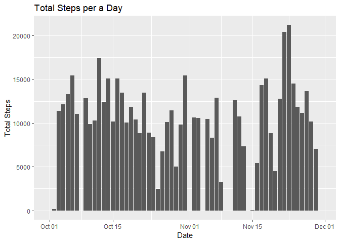
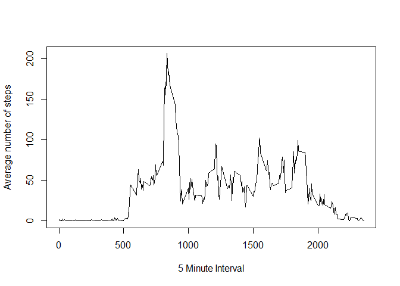
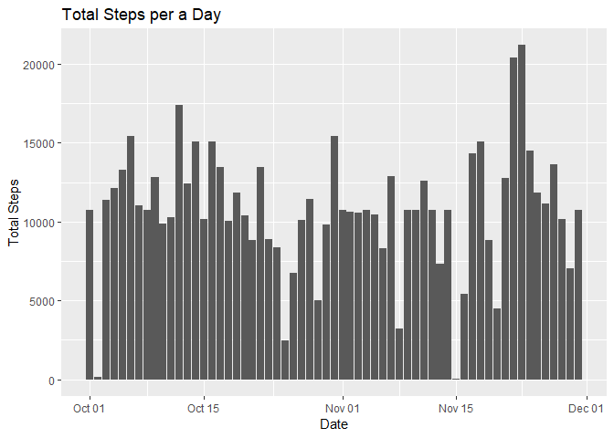

## Loading and preprocessing the data
First we should download the zipfile using the URL provided and read the CSV file after unzipping it.


```r
ActivityURL<- "https://d396qusza40orc.cloudfront.net/repdata%2Fdata%2Factivity.zip"
download.file(ActivityURL, destfile = "./activity.zip", method = "curl")
unzip("activity.zip")
activityData<- read.csv("activity.csv")
```

The date coloumn is currently classed a factor, we can change it to the date class


```r
activityData$date<- as.Date(activityData$date,format= "%Y-%m-%d")
```


## What is mean total number of steps taken per day?

We can find out the total number of steps taken per a day and present them in a **histogram**, using the ggplot2 and dplyr packages.


```r
library(ggplot2)
library(dplyr)
```


```r
dailySteps<- activityData %>% group_by(date) %>% summarise(total= sum(steps, na.rm = TRUE))

ggplot(dailySteps, aes(date, total, group= date))+
  geom_col()+
  labs(title = "Total Steps per a Day", x= "Date", y= "Total Steps")
```

<!-- -->

We can then calculate the **average** total steps per day


```r
mean(dailySteps$total)
```

```
## [1] 9354.23
```

and the **median** total number of steps a day


```r
median(dailySteps$total)
```

```
## [1] 10395
```

## What is the average daily activity pattern?

We can plot the **average** number of steps for each 5 minute interval in a day by making a **time series plot**


```r
intervalSteps<- activityData %>% group_by(interval) %>% summarise(average= mean(steps, na.rm = TRUE))
with(intervalSteps, plot(interval, average, type = "l", xlab = "5 Minute Interval", ylab = "Average number of steps"))
```

<!-- -->

And with this data we can find out which 5 minute interval has the **highest average** for a day


```r
intervalSteps$interval[which.max(intervalSteps$average)]
```

```
## [1] 835
```


## Imputing missing values

There are many  missing values in the data, we can find out the exact number to see how much of an effect they have on the analysis


```r
table(is.na(activityData$steps))
```

```
## 
## FALSE  TRUE 
## 15264  2304
```

As we can see there is a significant amount, so we can try and replace the missing values with a logical alternative, such as the average for each interval which we calculated previously. We can make a new **histogram** with the NA values replaced by the **mean number of steps of the respective interval**


```r
activityData[,1][is.na(activityData[,1])]<- intervalSteps$average
dailyStepsWithmean<- activityData %>% group_by(date) %>% summarise(total= sum(steps))
ggplot(dailyStepsWithmean, aes(date, total))+
   geom_col()+
   labs(title = "Total Steps per a Day", x= "Date", y= "Total Steps")
```

<!-- -->

It is possible to see in the histogram that there is less gaps when we replace the NA values, we can also test if the **mean** and **median** are affected


```r
mean(dailyStepsWithmean$total)
```

```
## [1] 10766.19
```

```r
median(dailyStepsWithmean$total)
```

```
## [1] 10766.19
```

We now see that the mean and median have converged, which is not suprising as we replaced a significant amount of missing values with their corresponding average value
## Are there differences in activity patterns between weekdays and weekends?

To find out if theres a difference first we have to categorise the observations into **weekday** or **weekend**. We can do this using the weekdays function and creating a new factor variable for the data


```r
weekdayOrEnd<- activityData %>% 
mutate(day= if_else((weekdays(activityData$date)=="Saturday"| weekdays(activityData$date)== "Sunday"), "Weekend", "Weekday"))
weekdayOrEnd$day<- as.factor(weekdayOrEnd$day)
```

Now we can plot two time series panels to compare the average steps per 5 minute interval on weekend and a weekday using the lattice plotting system


```r
library(lattice)
intervalStepsDay<- weekdayOrEnd %>% group_by(interval,day) %>% summarise(average= mean(steps))
xyplot(average ~ interval| day,
        data = intervalStepsDay,
        type="l",
        ylab = "number of steps",
        layout=c(1,2))
```

<!-- -->
